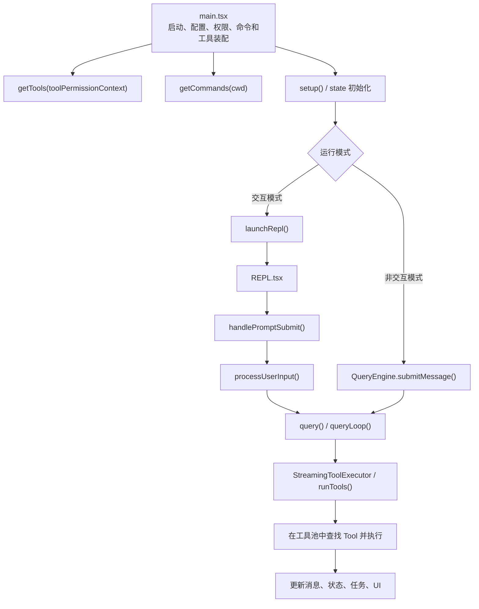
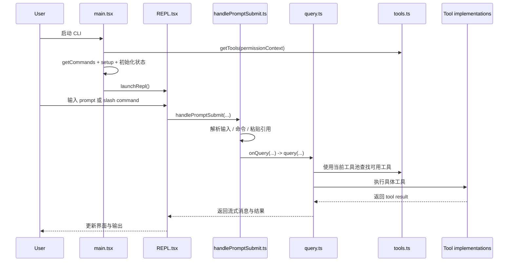

# Claude Code 2.1.88 主执行链分析

## 目标

这份文档追踪一条最重要的主路径：

`main.tsx -> REPL / QueryEngine -> query.ts -> tools.ts / Tool.ts`

用户提到的 `main.tsx -> Task.ts -> tools.ts` 可以理解成“从启动层一路追到任务与工具执行层”。严格来说，`Task.ts` 更偏任务模型定义；真正把任务和工具串起来的，是 `REPL.tsx`、`handlePromptSubmit.ts`、`processUserInput.ts`、`query.ts`、`Task.ts` 以及 `tasks/` 目录中的具体任务实现。

## 总体结论

主执行链不是线性调用，而是两条路径并存：

- 非交互路径：`main.tsx -> QueryEngine -> query.ts -> runTools`
- 交互路径：`main.tsx -> launchRepl -> REPL.tsx -> handlePromptSubmit -> processUserInput -> query.ts -> runTools`

`Task.ts` 在这两条路径里负责提供任务抽象，而不是直接承担查询主循环。

## 一图看懂

## 第 1 层：`main.tsx`

`main.tsx` 是整个系统的启动装配器，承担的关键工作包括：

- 读取启动参数
- 加载配置与权限模式
- 初始化技能和插件
- 调用 `getTools(toolPermissionContext)` 得到初始工具池
- 调用 `getCommands(cwd)` 得到命令池
- 执行 `setup()`
- 初始化 `AppState`
- 决定进入 headless 路径还是 REPL 路径

其中非常关键的片段是：

- 先 `maybeActivateProactive(options)`
- 再 `getTools(toolPermissionContext)`

这说明工具池在启动早期就已经与当前运行模式绑定。

## 第 2 层：REPL 启动路径

在交互模式下，`main.tsx` 会调用：

- `launchRepl(root, appProps, replProps, renderAndRun)`

`launchRepl()` 本身很薄，只做两件事：

1. 动态导入 `components/App`
2. 动态导入 `screens/REPL`

然后把 `<App><REPL /></App>` 渲染出来。

这说明：

- `main.tsx` 负责系统装配
- `REPL.tsx` 负责交互主循环

## 第 3 层：`REPL.tsx`

`REPL.tsx` 是交互式运行时的核心控制器。它做的事情很多，但和工具链路最相关的有四件：

### 1. 重新计算本地工具池

在 REPL 中会再次执行：

- `getTools(toolPermissionContext)`

原因是：

- 权限上下文会变化
- proactive 状态会变化
- brief 模式会变化

也就是说，REPL 里的工具池不是启动时固定好的，而是会随会话状态变化重算。

### 2. 合并 MCP 工具

REPL 中会把：

- 本地工具
- 初始工具
- MCP 连接带来的工具

合并成最终工具集，再通过 `useMergedTools` 和 `mergeAndFilterTools` 做过滤。

### 3. 合并命令

REPL 中同样会把：

- 本地命令
- 插件命令
- MCP 命令

合并成最终命令集。

### 4. 接收用户输入并启动查询

REPL 的提交入口最终会走向：

- `handlePromptSubmit()`

## 第 4 层：`handlePromptSubmit.ts`

这个模块负责把“用户输入”转换成“可执行查询”。

它做的关键工作包括：

- 处理直接输入和排队命令
- 处理 `/command` 型输入
- 识别 immediate command
- 解析粘贴引用与富输入
- 构造 `ProcessUserInputContext`
- 调用 `processUserInput()`
- 最后调用 `onQuery(...)`

这里的意义是：

- 命令系统在这里被真正消费
- 工具上下文在这里被真正构建
- 查询主循环在这里被真正触发

## 第 5 层：`QueryEngine.ts` 与 `query.ts`

### `QueryEngine.ts`

`QueryEngine` 更像“面向 headless / SDK 的会话控制器”。它保存：

- `messages`
- `tools`
- `commands`
- `mcpClients`
- `readFileCache`
- `permissionDenials`

调用 `submitMessage()` 时，它会：

1. 构建 `ToolUseContext`
2. 准备 system prompt、messages、user context
3. 调用底层 `query()`

### `query.ts`

`query.ts` 是真正的查询执行主循环。它负责：

- 组装 API 请求
- 处理上下文压缩
- 处理流式消息
- 处理 tool use block
- 调用 `runTools()`
- 把工具结果重新塞回消息流
- 驱动多轮 tool-use / assistant-response 循环

如果只看“模型如何真正调用工具”，`query.ts` 是最关键的核心文件。

## 第 6 层：工具执行

在 `query.ts` 中，工具执行依赖两层：

- `StreamingToolExecutor`
- `runTools()` / `services/tools/toolOrchestration`

它们的职责是：

- 识别 assistant 返回的 tool use
- 在当前工具池中查找工具实现
- 执行权限检查
- 调用对应 `Tool` 实现
- 把结果格式化为 tool result message

## 第 7 层：`Tool.ts` 与 `tools.ts`

### `Tool.ts`

这里定义的是工具抽象本身，包括：

- 工具描述
- 工具权限上下文
- 工具使用上下文
- 与消息、状态、通知、会话相关的执行时依赖

它解决的问题是：

- 一个工具被调用时，到底能拿到哪些上下文
- 工具结果如何返回到消息主循环

### `tools.ts`

这里定义的是“有哪些工具能被看见”。

它解决的问题是：

- 当前环境有哪些基础工具
- 哪些工具因为 feature flag 被裁剪
- 哪些工具因为权限或模式被剔除

因此：

- `Tool.ts` 更像接口与上下文契约
- `tools.ts` 更像工具注册表和可见性控制器

## `Task.ts` 在这条链路中的位置

`Task.ts` 不是查询主循环本身，而是任务模型定义层。它主要定义：

- `TaskType`
- `TaskStatus`
- `TaskContext`
- `TaskStateBase`
- `generateTaskId()`
- `createTaskStateBase()`

它的价值是给任务系统提供统一数据模型。

真正和任务执行直接相关的，是：

- `src/tasks/`
- `src/tasks/LocalMainSessionTask.ts`
- `src/tasks/LocalShellTask/`
- `src/tasks/RemoteAgentTask/`

所以如果用更准确的话说，这条链不是：

`main.tsx -> Task.ts -> tools.ts`

而更接近：

`main.tsx -> REPL / QueryEngine -> query.ts -> Tool.ts / tools.ts -> tasks/*`

其中 `Task.ts` 负责“任务数据模型”，`tasks/*` 负责“任务执行实现”。

## 更细的时序图

## 架构判断

从这条链路可以看出几个关键设计点：

- `main.tsx` 是装配器，不是业务执行器
- `REPL.tsx` 是交互态控制器
- `QueryEngine.ts` 是 headless / SDK 路径的会话控制器
- `query.ts` 是真正的执行内核
- `tools.ts` 决定工具集合
- `Tool.ts` 决定工具契约
- `Task.ts` 决定任务数据模型
- `tasks/*` 决定任务具体执行方式

## 最值得继续深挖的文件

如果你下一步要把执行链再往下挖，优先级最高的是：

1. `src/query.ts`
2. `src/Tool.ts`
3. `src/tools.ts`
4. `src/utils/processUserInput/processUserInput.ts`
5. `src/services/tools/toolOrchestration.ts`
6. `src/tasks/LocalMainSessionTask.ts`
