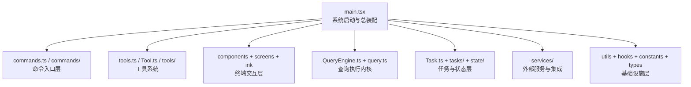
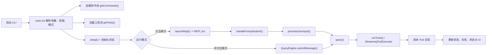

# Claude Code 2.1.88 源码分析总览

> 本目录中的源码由 `cli.js.map` 中的 `sources` 与 `sourcesContent` 还原得到，重点保留包自身的 `src/**` 源文件。这份 README 不是简单目录说明，而是一份面向源码阅读者的技术导读首页。

## 这个项目是什么

这份还原源码对应的是 Claude Code 2.1.88 的终端 Agent 工程。它不是单纯的命令行脚本集合，而是一套完整的终端应用与 agent 执行系统，主要包括：

- 启动与运行模式装配
- 命令系统
- 工具系统
- 交互式终端 UI
- 查询执行内核
- 任务与状态管理
- MCP / 插件 / 技能扩展能力

从源码结构上看，这个项目更像“终端中的多层 Agent 平台”，而不是单一用途的 CLI。

## 分析目标

这份还原源码主要用于回答四类问题：

1. Claude Code 的整体架构是什么
2. 命令系统如何组织
3. 工具系统如何装配与裁剪
4. 从启动到工具执行的主链路如何贯通

## 还原范围

- 包入口：`node_modules/@anthropic-ai/claude-code/cli.js`
- Source Map：`node_modules/@anthropic-ai/claude-code/cli.js.map`
- 还原源码：`reconstructed/src`
- 还原摘要：`reconstructed/restore-summary.json`

本次共还原出约 `1902` 个包自身源码文件。

## 配套文档

这次分析已经拆成四份文档，分别解决不同层次的问题：

- `README.md`
  总览文档，适合先建立整体认识，先看项目定位、架构、流程和推荐阅读顺序。

- `COMMANDS_ANALYSIS.md`
  命令系统清单、分类与职责分析，适合回答“这个 CLI 暴露了哪些命令入口，它们大致属于什么类别”。

- `TOOLS_ANALYSIS.md`
  工具系统装配逻辑、能力矩阵与风险面分析，适合回答“模型到底能调用哪些能力，这些工具如何被筛选和组合”。

- `EXECUTION_FLOW.md`
  主执行链分析，覆盖 `main.tsx -> REPL / QueryEngine -> query -> tools`，适合回答“从启动到工具执行的主流程到底怎么跑起来”。

- `SOURCE_INDEX.md`
  全量目录与文件索引，适合逐目录检索文件用途，按目录分组列出每个文件并附带作用说明。

## 项目性质

从还原出的源码结构看，这不是一个“普通命令行工具”，而是一个终端中的 agent 系统。它同时具备：

- 命令系统
- 工具执行系统
- 交互式终端 UI
- 会话与状态管理
- 多任务 / 多代理支持
- MCP / 插件 / 技能扩展机制
- 远程连接与桥接能力

## 架构概览

## 主执行流程

## 模块分层

### 1. 启动与装配层

关键文件：

- `src/main.tsx`
- `src/setup.ts`
- `src/context.ts`
- `src/bootstrap/`

职责：

- 解释命令行参数
- 初始化权限和配置
- 装配命令池与工具池
- 初始化应用状态
- 决定进入 REPL 还是 headless 路径

### 2. 命令系统

关键文件：

- `src/commands.ts`
- `src/commands/`

职责：

- 定义 CLI 的命令入口面
- 组合内置命令、技能命令、插件命令和 MCP 命令
- 通过 feature flag 与运行环境控制命令可见性

详细分析见：

- `COMMANDS_ANALYSIS.md`

### 3. 工具系统

关键文件：

- `src/tools.ts`
- `src/Tool.ts`
- `src/tools/`
- `src/utils/toolPool.ts`

职责：

- 定义工具抽象与执行上下文
- 装配工具池
- 按权限、模式和 feature flag 过滤工具
- 与 MCP 工具及代理限制联合裁剪最终工具集

详细分析见：

- `TOOLS_ANALYSIS.md`

### 4. 查询与执行内核

关键文件：

- `src/QueryEngine.ts`
- `src/query.ts`
- `src/utils/handlePromptSubmit.ts`
- `src/utils/processUserInput/processUserInput.ts`

职责：

- 把用户输入转换成查询
- 组织 system prompt、messages、上下文和工具集
- 处理流式响应
- 识别并执行 tool use
- 把工具结果重新注入对话循环

详细分析见：

- `EXECUTION_FLOW.md`

### 5. 终端交互层

关键目录：

- `src/components/`
- `src/screens/`
- `src/ink/`

职责：

- 构建交互式终端 UI
- 展示消息、任务、权限请求和状态变化
- 驱动 REPL 输入输出体验

### 6. 任务与状态层

关键文件：

- `src/Task.ts`
- `src/tasks/`
- `src/state/`
- `src/history.ts`

职责：

- 定义任务数据模型
- 管理本地任务、代理任务、后台任务
- 管理会话状态与应用状态

### 7. 服务与集成层

关键目录：

- `src/services/`
- `src/remote/`
- `src/server/`
- `src/bridge/`
- `src/plugins/`
- `src/skills/`

职责：

- 连接外部平台与协议
- 支持 MCP、插件、技能、远程会话和桥接模式

## 规模判断

按文件数量看，这份源码最重的几层是：

| 目录 | 文件数 | 判断 |
| --- | ---: | --- |
| `utils/` | 564 | 基础设施最重，说明底层能力极多 |
| `components/` | 389 | 终端 UI 复杂度很高 |
| `commands/` | 207 | 命令系统非常丰富 |
| `tools/` | 184 | 工具系统是核心能力层 |
| `services/` | 130 | 外部集成面较广 |
| `hooks/` | 104 | 交互层状态与副作用复杂 |
| `ink/` | 96 | 终端渲染层不是薄壳 |

## 推荐阅读顺序

### 想先看整体架构

1. `src/main.tsx`
2. `src/commands.ts`
3. `src/tools.ts`
4. `src/Tool.ts`
5. `src/QueryEngine.ts`
6. `src/query.ts`

### 想看命令系统

1. `src/commands.ts`
2. `COMMANDS_ANALYSIS.md`
3. `src/commands/`

### 想看工具系统

1. `src/Tool.ts`
2. `src/tools.ts`
3. `TOOLS_ANALYSIS.md`
4. `src/tools/`

### 想看主调用链

1. `EXECUTION_FLOW.md`
2. `src/main.tsx`
3. `src/screens/REPL.tsx`
4. `src/utils/handlePromptSubmit.ts`
5. `src/query.ts`

### 想查具体文件

1. `SOURCE_INDEX.md`

## 当前最重要的分析结论

- `main.tsx` 是系统装配器，不是单纯入口脚本
- `commands.ts` 决定外部命令接口面
- `tools.ts` 决定模型可见工具集合
- `Tool.ts` 定义工具契约与工具执行上下文
- `REPL.tsx` 是交互态控制中心
- `query.ts` 是真正的执行内核
- `Task.ts` 主要是任务模型定义，具体任务执行更多落在 `tasks/*`
